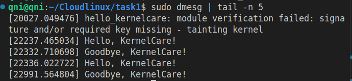
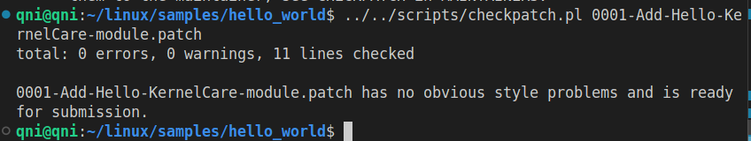
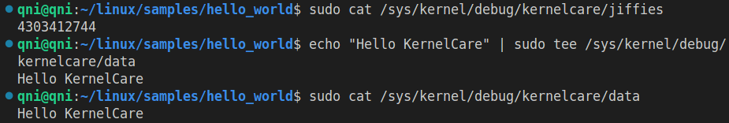
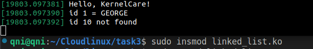

# Cloudlinux

Each task is done on a real machine.

## Task 1

Compile module  
`make`

Add module  
`sudo insmod hello_kernelcare.ko`

Show message module  
`dmesg | tail -n 5`

Delete module  
`sudo rmmod hello_kernelcare.ko`

Proof:

## Task 2

Compile module  
`make`

Add module  
`sudo insmod data_module.ko`

Show message module  
`dmesg | tail -n 5`

Delete module  
`sudo rmmod data_module.ko`

Proof:  

## Task 3

Compile module  
`make`

Add module  
`sudo insmod linked_list.ko`

Show message module  
`dmesg | tail -n 5`

Delete module  
`sudo rmmod linked_list.ko`

Proof:  

